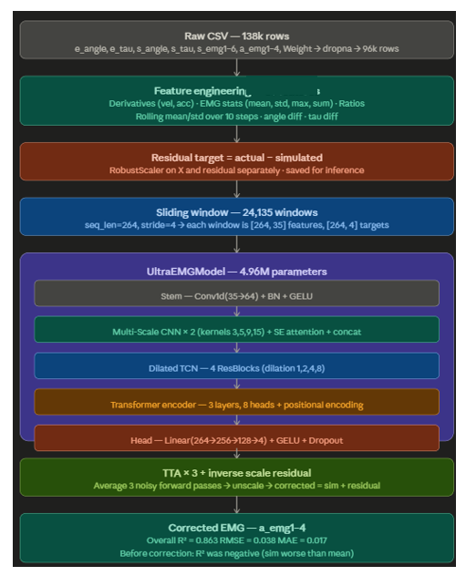
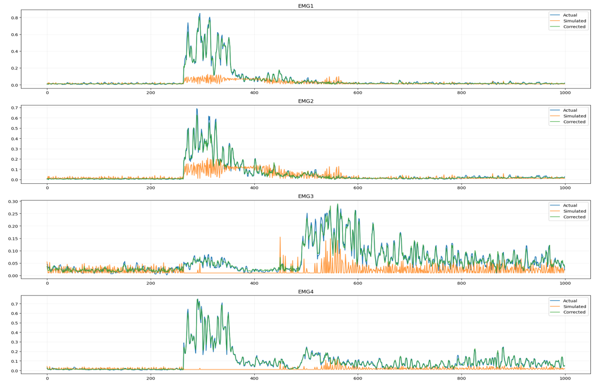

<div align="center">

# Residual Human–Robot Interaction Modeling

### Uncertainty-Aware Musculoskeletal Modeling for Wearable Robotics using OpenSim and Deep Learning

[]()
[]()
[]()
[]()

**Keywords**

`Wearable Robotics`
`Human-Robot Interaction`
`OpenSim`
`Biomechanics`
`EMG`
`Deep Learning`
`Residual Learning`
`Uncertainty Quantification`
`Digital Twin`

</div>

---

# Overview

Wearable robotic systems such as exosuits and exoskeletons rely on an accurate understanding of human muscle activity to provide safe and effective assistance. Although physics-based musculoskeletal simulators like **OpenSim** can estimate joint torques and muscle activations with high physiological fidelity, they are computationally intensive and often struggle to capture subject-specific variations observed in real-world experiments.

This project proposes an **uncertainty-aware residual learning framework** that bridges the gap between simulated and experimentally measured muscle activity. The framework combines motion capture, surface electromyography (EMG), biomechanical simulation, and deep learning to predict muscle behaviour while also estimating the confidence of each prediction.

Instead of replacing biomechanical simulations, the proposed approach learns the residual error between OpenSim predictions and actual EMG recordings. This hybrid strategy improves prediction accuracy while preserving the interpretability of physics-based models, making it suitable for future real-time wearable robotic systems.

---

# Highlights

- Physics-informed deep learning framework
- OpenSim-based musculoskeletal simulation
- Residual learning for EMG correction
- Aleatoric and Epistemic uncertainty estimation
- Multi-modal dataset (Motion Capture + EMG + OpenSim)
- Designed for future real-time exosuit control

---

# System Overview

<p align="center">
  
</p>

The proposed framework follows a modular pipeline consisting of data acquisition, biomechanical simulation, deep learning, and uncertainty estimation.

The workflow begins with synchronized motion capture and surface EMG recordings collected during upper-limb biceps curl experiments. Motion data are processed through OpenSim to estimate joint kinematics, joint torques, and muscle activations. These simulation outputs are combined with experimentally recorded EMG signals to generate a multimodal dataset. Deep learning models are then trained to predict residual muscle activity while quantifying prediction uncertainty.

---

# Methodology

The complete framework consists of six major stages.

## Data Acquisition

- Vicon Nexus Motion Capture
- Surface EMG Acquisition
- External Load Measurement
- Upper-Limb Biceps Curl Experiments

---

## Musculoskeletal Simulation

Experimental kinematic data are processed in **OpenSim** using

- Inverse Kinematics
- Inverse Dynamics
- Static Optimization
- Muscle Analysis

to estimate

- Joint Angles
- Joint Torques
- Muscle Activations
- Muscle Forces

---

## Signal Processing

Raw EMG signals undergo

- Notch Filtering
- Band-pass Filtering
- RMS Envelope Extraction
- Normalization
- Feature Engineering

to generate reliable physiological representations suitable for machine learning.

---

## Residual Learning

Instead of directly predicting muscle activity, the model learns

```
Residual = |EMG_actual − EMG_OpenSim|
```

This enables the framework to compensate for modeling errors introduced by biomechanical assumptions and physiological variability.

---

## Deep Learning Models

Several architectures were investigated, including

- CNN
- LSTM
- Transformer
- CNN-LSTM
- CNN-Transformer
- Residual Neural Networks

to model upper-limb muscle behaviour.

---

## Uncertainty Quantification

Prediction uncertainty is decomposed into

- Aleatoric Uncertainty (measurement noise)
- Epistemic Uncertainty (model uncertainty)

using Monte Carlo Dropout to improve prediction reliability for safety-critical robotic applications.

---

# Hardware Platform

| Component | Details |
|------------|---------|
| Motion Capture | Vicon Nexus |
| EMG Acquisition | Multi-channel Surface EMG |
| Simulation | OpenSim 4.5 |
| Framework | PyTorch |
| Programming Language | Python |
| Development Environment | Jupyter Notebook |
| Compute | NVIDIA GPU |
| Target Application | Wearable Robotics & Rehabilitation |

---

# Results

<p align="center">
  
</p>

The proposed framework demonstrates strong agreement between simulated and experimentally measured muscle activations.

### Key Outcomes

- Residual learning significantly improves prediction accuracy over simulation-only estimates.
- Deep learning models successfully capture nonlinear relationships between biomechanical variables and muscle activation.
- The uncertainty-aware framework provides confidence estimates alongside every prediction.
- Coefficients of determination (R²) exceeded **0.84**, with some muscle channels achieving values close to **0.93**.
- The framework establishes a foundation for future real-time human–robot interaction and wearable robotic control.

---

# Repository Structure

```
Residual-HRI-Modeling/

├── dataset/
├── models/
├── notebooks/
├── src/
├── media/
├── report/
├── results/
├── scripts/
├── requirements.txt
└── README.md
```

---

# Demonstration

<div align="center">

[](simulation/simulation_video.mp4)

**Click the image above to watch the demonstration**

</div>

---

# Thesis Report and Presentation

| Document | Link |
|-----------|------|
| Thesis | report/thesis.pdf |
| Presentation | report/presentation.pdf |

---

# Citation

```bibtex
@mastersthesis{Shakyawar2026,
  author = {Nishank Shakyawar},
  title = {Residual Human--Robot Interaction Modeling},
  school = {Indian Institute of Technology Delhi},
  year = {2026},
  note = {M.Tech in Robotics, CoE-BIRD}
}
```

---

# Team

| Role | Name |
|------|------|
| Researcher | Nishank Shakyawar |
| Supervisor | Prof. Shubhendu Bhasin |
| Co-Supervisor | Prof. Sitikantha Roy |

---

# Acknowledgements

This work was carried out at the **Centre of Excellence on Biologically Inspired Robots and Drones (CoE-BIRD), Indian Institute of Technology Delhi**, as part of the requirements for the Master of Technology in Robotics. The project was completed under the guidance of **Prof. Shubhendu Bhasin** and **Prof. Sitikantha Roy**.

---

<div align="center">

⭐ If you find this work useful, consider giving the repository a star.

</div>
